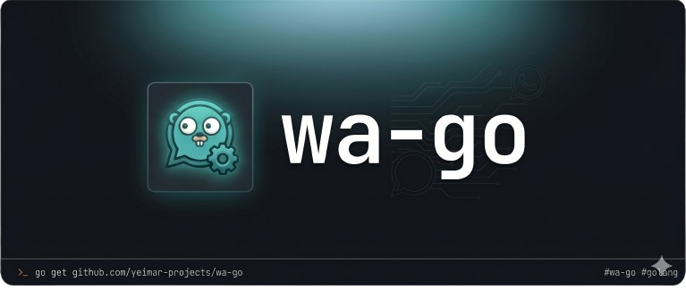
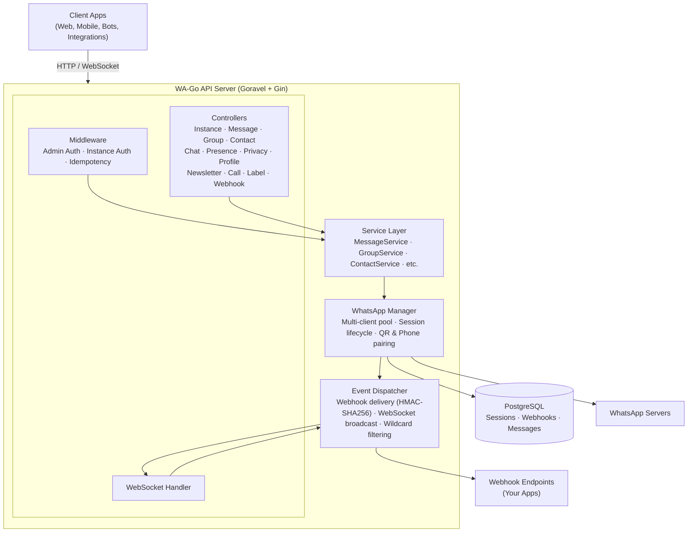

<div align="center">



<br/><br/>

# WhatsApp for developers

**Self-hosted, multi-instance edge service for WhatsApp — manage many sessions, send messages and react to events through a REST API and a real-time stream.**

[](https://github.com/yeimar-projects/wa-go/actions/workflows/ci.yml)
[](https://go.dev/)
[](LICENSE)
[](https://www.goravel.dev)

</div>

wa-go wraps [whatsmeow](https://github.com/tulir/whatsmeow) in a [Goravel](https://www.goravel.dev) service so the rest of your stack only ever sees idiomatic HTTP. It is designed as an **edge component meant to be combined with a larger platform**: wa-go owns the WhatsApp protocol and nothing else. Orchestration, AI agents, media pipelines and admin UI live in their own services and integrate with wa-go over webhooks or WebSocket — they never touch the wire.

---

## Table of Contents

- [The Problem](#the-problem)
- [Built for](#built-for)
- [Production Primitives](#production-primitives)
- [Features](#features)
- [Architecture](#architecture)
- [Quick Start](#quick-start)
- [Build from Source](#build-from-source)
- [Authentication](#authentication)
- [API Endpoints](#api-endpoints)
- [Sending Messages](#sending-messages)
- [Response Format](#response-format)
- [Idempotency](#idempotency)
- [Event System](#event-system)
- [Configuration Reference](#configuration-reference)
- [Testing](#testing)
- [Troubleshooting](#troubleshooting)
- [Contributing](#contributing)
- [Roadmap](#roadmap)
- [License](#license)

---

## The Problem

Building anything on top of WhatsApp that isn't the official Cloud API means either reverse-engineering the protocol yourself or wrapping a low-level Go library like [whatsmeow](https://github.com/tulir/whatsmeow). Either way, you end up owning a lot of plumbing before you can write a single line of business logic:

- **Session lifecycle.** QR pairing, phone pairing, reconnects after a network blip, logout, persistent device store. For one account this is tedious; for many accounts on a single host it is its own small product.
- **A network-facing API.** Your other services (AI agents, CRM, dashboards, schedulers) need to send messages and react to events without learning the WhatsApp wire format. Somebody has to translate "send an image to this number" into the right whatsmeow call.
- **The boring-but-critical pieces.** Idempotent sends so retries don't double-deliver. Signed webhooks so consumers can trust the source. Wildcard event subscriptions. Structured errors with stable codes. Connection state surfaced as HTTP, not as panics.

wa-go is the layer that owns all of that. It wraps whatsmeow in a multi-instance Goravel service and exposes a REST + WebSocket surface, so the rest of your stack only ever sees idiomatic HTTP.

---

## Built for

wa-go is the building block you put underneath a larger platform — not the platform itself. Typical uses:

- **AI conversational agents.** Receive voice notes, push them through your STT → LLM → TTS pipeline, send the response back as audio.
- **Customer service platforms.** Many numbers, many agents, idempotent sends, signed webhooks.
- **Internal CRM and notification systems.** Trigger messages from your existing services without re-implementing the WhatsApp protocol.
- **Automation and scheduling.** Hook wa-go into Make, n8n, Temporal, or your own scheduler over webhooks or WebSocket.

It is designed to be combined: drop it in as the WhatsApp tier and build whatever business logic, UI or orchestration you need on top.

---

## Production Primitives

The pieces you usually have to build yourself before shipping anything serious are already there:

- **HMAC-signed webhooks** with `X-Webhook-Signature` — opt-in per webhook by setting a `secret`.
- **Idempotency keys** make `POST /messages` safe to retry without double-sending.
- **Wildcard event subscriptions** (`message.*`, `*`) for clean fan-out.
- **Structured errors** with stable machine-readable codes — see [Response Format](#response-format).
- **CI gates**: `go vet`, lint, unit tests with `-race`, and a Newman smoke that boots the server against a real Postgres in GitHub Actions.
- **Multi-instance from day one**, with a single shared whatsmeow session store.

---

## Features

At a glance:

- 📱 **Full WhatsApp API surface** — messages, groups, contacts, chats, calls, profile, labels, newsletters.
- ⚡ **Real-time events** over WebSocket and signed webhooks with wildcard routing.
- 🔒 **Production primitives** — idempotency, HMAC, structured errors, automatic retry-aware design.
- 🔄 **Multi-instance** — many WhatsApp accounts in a single process, sharing one session store.
- 🚀 **One-binary deployment** with Docker Compose included.

Detail by area:

| Category | Capabilities |
|----------|-------------|
| **Messaging** | Text, images, documents, audio, video, stickers (animated), contacts, location, polls, reactions, edits, revoke, star/unstar |
| **Groups** | Create, manage participants, settings, photo, invite links, join requests |
| **Contacts** | Check existence, profile info, profile picture, business profile, block/unblock, blocklist |
| **Chats** | Pin/unpin, archive/unarchive, mute/unmute, mark as read, disappearing messages, chat history, typing indicators |
| **Presence** | Online status subscription, typing indicators |
| **Newsletters** | List, get, follow/unfollow, mute/unmute channels |
| **Calls** | Reject incoming calls (manual + auto-reject) |
| **Privacy** | Get and update privacy settings |
| **Profile** | Update display name, avatar, status, QR link |
| **Labels** | Create labels, assign to chats |
| **Events** | Webhooks (HMAC-SHA256 signed) + WebSocket real-time stream |
| **Reliability** | Idempotency keys to prevent duplicate sends |
| **Auth** | QR Code and Phone Pairing support |
| **Automation** | Auto-reply, auto-mark-read, auto-reject-call |

---

## Architecture



---

## Quick Start

The fastest path is Docker Compose — it spins up Postgres 16 alongside the API:

```bash
git clone https://github.com/yeimar-projects/wa-go.git
cd wa-go
cp .env.example .env
# edit .env: set APP_KEY, WA_GLOBAL_API_KEY, DB_USERNAME, DB_PASSWORD, DB_DATABASE

docker compose up -d
docker compose logs -f goravel
```

Server starts at `http://localhost:3000`. Now create your first instance and pair it:

```bash
# 1. Create instance
curl -X POST http://localhost:3000/api/v1/instances \
  -H "apikey: your-secret-admin-key" \
  -H "Content-Type: application/json" \
  -d '{"name": "my-whatsapp"}'
# → response contains the per-instance token

# 2. Fetch the pairing QR
curl http://localhost:3000/api/v1/instances/{id}/qr-code \
  -H "apikey: {instance-token}"
```

Scan the QR with WhatsApp on your phone and you're connected.

---

## Build from Source

Use this path when you are developing wa-go itself or want to run without Docker.

**Prerequisites:**

- Go 1.25+
- PostgreSQL 14+ (whatsmeow's session store requires Postgres even when `DB_CONNECTION=sqlite` — see [Troubleshooting](#troubleshooting))

```bash
git clone https://github.com/yeimar-projects/wa-go.git
cd wa-go
go mod tidy
cp .env.example .env
# minimum required:
#   APP_KEY=base64:<any-32-byte-base64-string>
#   WA_GLOBAL_API_KEY=your-secret-admin-key
#   DB_CONNECTION=postgres + DB_HOST/PORT/DATABASE/USERNAME/PASSWORD

go run .
```

The full list of supported variables lives in [Configuration Reference](#configuration-reference).

**Stand-alone Docker build** (no Compose, point `DB_HOST` to an existing Postgres):

```bash
docker build -t wa-go .
docker run -p 3000:3000 --env-file .env wa-go
```

---

## Authentication

Two levels of authentication via the `apikey` header:

| Scope | Header value |
|-------|--------------|
| Admin routes (`/api/v1/instances`, create/list/get/delete) | `WA_GLOBAL_API_KEY` from `.env` |
| Instance routes (`/api/v1/instances/{id}/*`) | Instance token (returned on creation) |

Instance auth also accepts `?apikey=` as a query parameter — useful for WebSocket connections from the browser.

---

## API Endpoints

All routes are prefixed with `/api/v1`. The canonical reference is the Postman collection: [`docs/wa-go-api.postman_collection.json`](docs/wa-go-api.postman_collection.json).

### Health & Instances (Admin)

| Method | Endpoint | Description |
|--------|----------|-------------|
| GET | `/health` | Health check |
| POST | `/instances` | Create instance |
| GET | `/instances` | List all instances |
| GET | `/instances/{id}` | Get instance details |
| DELETE | `/instances/{id}` | Delete instance |

### Instance Lifecycle

| Method | Endpoint | Description |
|--------|----------|-------------|
| POST | `/instances/{id}/connect` | Connect to WhatsApp |
| POST | `/instances/{id}/reconnect` | Force reconnect |
| POST | `/instances/{id}/disconnect` | Disconnect |
| POST | `/instances/{id}/logout` | Logout (clears session) |
| GET | `/instances/{id}/status` | Connection status |
| GET | `/instances/{id}/qr-code` | Get QR code for pairing |
| POST | `/instances/{id}/pair-phone` | Pair via phone number |

> Below, all paths are abbreviated as `/{id}/...` for brevity.

### Messages

| Method | Endpoint | Description |
|--------|----------|-------------|
| POST | `/{id}/messages` | Send message (text, media, location, contact, poll, sticker) |
| POST | `/{id}/messages/{msgId}/react` | React to message |
| POST | `/{id}/messages/{msgId}/revoke` | Revoke message |
| POST | `/{id}/messages/{msgId}/edit` | Edit message |
| POST | `/{id}/messages/{msgId}/read` | Mark as read |
| POST | `/{id}/messages/{msgId}/star` | Star message |
| POST | `/{id}/messages/{msgId}/unstar` | Unstar message |
| GET | `/{id}/messages/{msgId}/download` | Download media |

### Chats

| Method | Endpoint | Description |
|--------|----------|-------------|
| GET | `/{id}/chats` | List chats |
| GET | `/{id}/chats/{chatId}/messages` | Get chat messages |
| POST | `/{id}/chats/{chatId}/pin` | Pin chat |
| POST | `/{id}/chats/{chatId}/unpin` | Unpin chat |
| POST | `/{id}/chats/{chatId}/archive` | Archive chat |
| POST | `/{id}/chats/{chatId}/unarchive` | Unarchive chat |
| POST | `/{id}/chats/{chatId}/mute` | Mute chat |
| POST | `/{id}/chats/{chatId}/unmute` | Unmute chat |
| POST | `/{id}/chats/{chatId}/disappearing` | Set disappearing messages |
| POST | `/{id}/chats/{chatId}/presence` | Send typing/recording indicator |

### Groups

| Method | Endpoint | Description |
|--------|----------|-------------|
| GET | `/{id}/groups` | List groups |
| POST | `/{id}/groups` | Create group |
| GET | `/{id}/groups/{groupId}` | Group info |
| PATCH | `/{id}/groups/{groupId}/settings` | Update settings |
| POST | `/{id}/groups/{groupId}/join` | Join via invite link |
| POST | `/{id}/groups/{groupId}/leave` | Leave group |
| GET | `/{id}/groups/{groupId}/invite-link` | Get invite link |
| POST | `/{id}/groups/{groupId}/invite-link/reset` | Reset invite link |
| POST | `/{id}/groups/{groupId}/participants/add` | Add members |
| POST | `/{id}/groups/{groupId}/participants/remove` | Remove members |
| POST | `/{id}/groups/{groupId}/participants/promote` | Promote to admin |
| POST | `/{id}/groups/{groupId}/participants/demote` | Demote admin |
| POST | `/{id}/groups/{groupId}/photo` | Set group photo |
| GET | `/{id}/groups/{groupId}/join-requests` | List pending join requests |
| POST | `/{id}/groups/{groupId}/join-requests/handle` | Approve/reject join requests |

### Contacts

| Method | Endpoint | Description |
|--------|----------|-------------|
| POST | `/{id}/contacts/check` | Check if numbers exist on WhatsApp |
| GET | `/{id}/contacts/blocklist` | List blocked contacts |
| GET | `/{id}/contacts/{jid}` | Get contact info |
| GET | `/{id}/contacts/{jid}/profile-picture` | Get profile picture |
| GET | `/{id}/contacts/{jid}/business-profile` | Get business profile |
| POST | `/{id}/contacts/{jid}/block` | Block contact |
| POST | `/{id}/contacts/{jid}/unblock` | Unblock contact |

### Presence, Privacy & Profile

| Method | Endpoint | Description |
|--------|----------|-------------|
| PUT | `/{id}/presence` | Set presence (available/unavailable) |
| POST | `/{id}/presence/{jid}/subscribe` | Subscribe to contact presence |
| GET | `/{id}/privacy` | Get privacy settings |
| PATCH | `/{id}/privacy` | Update privacy settings |
| PUT | `/{id}/profile/status-message` | Set status message |
| POST | `/{id}/profile/avatar` | Set profile picture |
| POST | `/{id}/profile/pushname` | Set display name |
| GET | `/{id}/profile/qr-link` | Get profile QR link |
| POST | `/{id}/profile/qr-link/revoke` | Revoke profile QR link |

### Newsletters

| Method | Endpoint | Description |
|--------|----------|-------------|
| GET | `/{id}/newsletters` | List subscribed newsletters |
| GET | `/{id}/newsletters/{newsletterId}` | Get newsletter info |
| POST | `/{id}/newsletters/{newsletterId}/follow` | Follow newsletter |
| POST | `/{id}/newsletters/{newsletterId}/unfollow` | Unfollow newsletter |
| POST | `/{id}/newsletters/{newsletterId}/mute` | Mute newsletter |
| POST | `/{id}/newsletters/{newsletterId}/unmute` | Unmute newsletter |

### Calls

| Method | Endpoint | Description |
|--------|----------|-------------|
| POST | `/{id}/calls/{callId}/reject` | Reject an incoming call |

### Labels

| Method | Endpoint | Description |
|--------|----------|-------------|
| GET | `/{id}/labels` | List labels |
| POST | `/{id}/labels` | Create label |
| DELETE | `/{id}/labels/{labelId}` | Delete label |
| POST | `/{id}/labels/{labelId}/chat` | Assign label to chat |

### Webhooks & WebSocket

| Method | Endpoint | Description |
|--------|----------|-------------|
| POST | `/{id}/webhooks` | Register webhook |
| GET | `/{id}/webhooks` | List webhooks |
| GET | `/{id}/webhooks/{webhookId}` | Get webhook |
| DELETE | `/{id}/webhooks/{webhookId}` | Delete webhook |
| POST | `/{id}/webhooks/{webhookId}/test` | Test webhook delivery |
| GET | `/{id}/ws` | WebSocket connection |

---

## Sending Messages

`POST /{id}/messages` is polymorphic: the `type` field selects which payload is used. The other payload fields are ignored.

### Text

```bash
curl -X POST http://localhost:3000/api/v1/instances/{id}/messages \
  -H "apikey: {token}" \
  -H "Content-Type: application/json" \
  -d '{
    "to": "5491155555555@s.whatsapp.net",
    "type": "text",
    "text": { "body": "Hello from wa-go" }
  }'
```

### Image (URL or base64)

```bash
curl -X POST http://localhost:3000/api/v1/instances/{id}/messages \
  -H "apikey: {token}" \
  -H "Content-Type: application/json" \
  -d '{
    "to": "5491155555555@s.whatsapp.net",
    "type": "image",
    "image": {
      "url": "https://example.com/photo.jpg",
      "caption": "Sunset",
      "mimeType": "image/jpeg"
    }
  }'
```

Use `"base64": "<encoded-bytes>"` instead of `url` to upload binary data inline.

### Location

```bash
{
  "to": "5491155555555@s.whatsapp.net",
  "type": "location",
  "location": {
    "latitude": -34.6037,
    "longitude": -58.3816,
    "name": "Obelisco",
    "address": "Av. 9 de Julio, Buenos Aires"
  }
}
```

### Poll

```bash
{
  "to": "5491155555555@s.whatsapp.net",
  "type": "poll",
  "poll": {
    "name": "Lunch?",
    "options": ["Pizza", "Sushi", "Salad"],
    "selectableCount": 1
  }
}
```

### Reaction

```bash
{
  "to": "5491155555555@s.whatsapp.net",
  "type": "reaction",
  "reaction": {
    "key": { "id": "3EB0A1B2C3D4E5F60718", "fromMe": false },
    "emoji": "🔥"
  }
}
```

Supported `type` values: `text`, `image`, `video`, `audio`, `document`, `sticker`, `location`, `contacts`, `poll`, `reaction`. Optional fields on any type: `mentions` (array of JIDs), `replyTo` (message ID), `viewOnce` (bool).

---

## Response Format

Every endpoint returns the same JSON envelope.

**Success:**

```json
{
  "status": 200,
  "code": "SUCCESS",
  "message": "ok",
  "results": { "...": "..." }
}
```

**Error:**

```json
{
  "status": 400,
  "code": "VALIDATION_ERROR",
  "message": "'type' field is required"
}
```

Stable machine-readable error codes:

| Code | HTTP | When |
|------|------|------|
| `VALIDATION_ERROR` | 400 | Malformed/missing fields |
| `INVALID_JID` | 400 | Recipient JID could not be parsed |
| `UNAUTHORIZED` | 401 | Missing or invalid `apikey` |
| `FORBIDDEN` | 403 | Token does not own the instance |
| `NOT_FOUND` | 404 | Resource does not exist |
| `CONFLICT` | 409 | Duplicate resource / concurrent update |
| `RATE_LIMIT_EXCEEDED` | 429 | Throttled |
| `WHATSAPP_NOT_CONNECTED` | 503 | Instance is offline — call `/connect` |
| `SEND_FAILED` | 502 | WhatsApp rejected the send |
| `MEDIA_FETCH_FAILED` | 502 | Could not download upstream media |
| `UPLOAD_FAILED` | 502 | Could not upload media to WhatsApp |
| `INTERNAL_ERROR` | 500 | Unexpected server fault |

---

## Idempotency

Send-style endpoints accept the `Idempotency-Key` header. The first response for a given key is cached for 24 hours; replays return the same body and status without re-executing the action.

```bash
curl -X POST http://localhost:3000/api/v1/instances/{id}/messages \
  -H "apikey: {token}" \
  -H "Idempotency-Key: 7c2e4a1f-8b30-4d22-9c1d-1f7c0c9d5a2b" \
  -H "Content-Type: application/json" \
  -d '{ "to": "549...@s.whatsapp.net", "type": "text", "text": {"body": "hi"} }'
```

Use a fresh UUID per logical operation. Store is in-memory by default (capped via `IDEMPOTENCY_MAX_ENTRIES`, default `10000`) — swap for Redis if you run multiple replicas.

---

## Event System

### Webhooks

Register a webhook to receive HTTP POST callbacks when events occur:

```bash
curl -X POST http://localhost:3000/api/v1/instances/{id}/webhooks \
  -H "apikey: {token}" \
  -H "Content-Type: application/json" \
  -d '{
    "url": "https://your-app.com/webhook",
    "events": ["message.*", "connection.*"],
    "secret": "your-webhook-secret"
  }'
```

- Payloads are signed with HMAC-SHA256 in the `X-Webhook-Signature: sha256=<hex>` header
- Wildcards like `message.*` subscribe to event groups; `*` subscribes to everything
- An empty `events` array also means "all events"

**Verifying the signature (Node.js):**

```js
const crypto = require("crypto");
const expected = "sha256=" + crypto
  .createHmac("sha256", process.env.WEBHOOK_SECRET)
  .update(rawBody)
  .digest("hex");
if (!crypto.timingSafeEqual(Buffer.from(expected), Buffer.from(req.headers["x-webhook-signature"]))) {
  return res.status(401).end();
}
```

### WebSocket

Connect for real-time event streaming:

```
ws://localhost:3000/api/v1/instances/{id}/ws?apikey={token}
```

Event payload:

```json
{
  "id": "550e8400-e29b-41d4-a716-446655440000",
  "type": "message.received",
  "instanceId": "instance-id",
  "timestamp": "2026-05-14T07:30:00Z",
  "data": { "...": "..." }
}
```

Slow consumers are dropped — keep the read loop tight.

---

## Configuration Reference

| Variable | Description | Default |
|----------|-------------|---------|
| `APP_KEY` | Application key (32-byte base64). Required outside `APP_ENV=local` | — |
| `APP_PORT` | Server port | `3000` |
| `DB_CONNECTION` | Database driver (`postgres`, `sqlite`) | — |
| `DB_HOST` | Database host | — |
| `DB_PORT` | Database port | — |
| `DB_DATABASE` | Database name | — |
| `DB_USERNAME` | Database user | — |
| `DB_PASSWORD` | Database password | — |
| `WA_AUTH_DATABASE_URL` | Postgres DSN for whatsmeow session store (defaults to `DB_*`) | — |
| `WA_GLOBAL_API_KEY` | Admin API key for instance management | — |
| `WA_CONNECT_ON_STARTUP` | Auto-connect all instances on boot | `true` |
| `WA_CHECK_USER_EXISTS` | Verify recipient exists before sending | `true` |
| `WA_SAVE_MESSAGES` | Persist sent/received messages to DB | `false` |
| `WA_DEBUG` | whatsmeow log level (`INFO`, `DEBUG`, `WARN`) | `INFO` |
| `WA_CLIENT_NAME` | Client display name in WhatsApp | `wa-go` |
| `WA_QRCODE_MAX_COUNT` | Max QR code generation attempts per session | `5` |
| `WA_AUTO_REPLY` | Auto-reply message for incoming DMs | — |
| `WA_AUTO_MARK_READ` | Automatically mark incoming messages as read | `false` |
| `WA_AUTO_REJECT_CALL` | Automatically reject incoming calls | `false` |
| `IDEMPOTENCY_MAX_ENTRIES` | Max cached idempotency keys in memory | `10000` |

---

## Testing

```bash
# Unit tests (no DB required)
go test ./tests/unit/... -count=1

# Feature tests (boots the full app)
go test ./tests/feature/... -count=1

# Single test/suite with race detector
go test -race -run TestHealth ./tests/feature/...

# Smoke test the running server with Newman
newman run docs/wa-go-api.postman_collection.json --folder Health \
  --env-var baseUrl=http://localhost:3000/api/v1
```

CI runs `vet`, `lint` (advisory), unit tests with `-race`, and a Newman smoke test against a Postgres service. See [`.github/workflows/ci.yml`](.github/workflows/ci.yml).

---

## Troubleshooting

**`failed to open whatsmeow store` on boot.** whatsmeow's session store always uses Postgres, even when `DB_CONNECTION=sqlite`. Start a Postgres instance and either point `DB_*` at it or set `WA_AUTH_DATABASE_URL` explicitly.

**Server starts but instance creation returns 500.** Same root cause as above — the manager logs a warning on boot but the store is unusable. Check the logs for `whatsmeow store`.

**QR code never appears / scan loops.** Make sure your phone has internet and that the instance's WhatsApp Business app is not opened on another linked device. Increase `WA_QRCODE_MAX_COUNT` to allow more retries.

**`WHATSAPP_NOT_CONNECTED` on send.** The instance disconnected (network blip, logout from phone). Call `POST /{id}/connect` or `/{id}/reconnect`.

**Webhook signature mismatch.** Verify you are using the **raw** request body (no JSON re-serialization) and the **per-webhook secret**, not the admin API key.

**CRLF warnings on Windows during `git add`.** Expected — Git normalizes line endings via `.gitattributes`. Safe to ignore.

---

## Contributing

PRs are welcome. Before opening one:

1. `go vet ./app/... ./bootstrap/... ./config/... ./routes/...`
2. `go test ./tests/unit/... -count=1`
3. Update the Postman collection (`docs/wa-go-api.postman_collection.json`) if you add or change endpoints.
4. Do **not** modify `whatsmeow-lib/` — it is a vendored fork pulled in via a `go.mod` replace directive.

See [CLAUDE.md](CLAUDE.md) for architecture notes (boot flow, DI container, event dispatcher invariants, known gotchas).

---

## Roadmap

Things that are missing or worth tightening — ordered roughly by priority.

**Reliability & scale**

- [ ] Move the idempotency store from in-memory map to Redis so multiple replicas can share state.
- [ ] Retry webhook deliveries with exponential backoff + jitter (today they are fire-and-forget; failures only log a warning).
- [ ] Dead-letter queue for webhooks that exhaust their retries, exposed via a small admin endpoint.
- [ ] Per-instance rate limiting on `/messages` and the contact-check endpoint.

**Observability**

- [ ] Prometheus `/metrics` endpoint (events dispatched, webhook delivery latency, send success/failure).
- [ ] OpenTelemetry traces across controller → service → manager → whatsmeow.
- [ ] Deeper `/health` that surfaces DB connectivity and per-instance WhatsApp status.

**API & docs**

- [ ] **gRPC API with parity to REST** — proto-defined `InstanceService`, `MessageService`, etc. plus a server-streaming `EventService` as the gRPC equivalent of the WebSocket. See the design notes in [`docs/grpc-plan.md`](docs/grpc-plan.md).
- [ ] OpenAPI 3.1 spec generated from the controllers (replace the hand-written Postman collection as the source of truth).
- [ ] Thin official client SDKs (Go and TypeScript first).
- [ ] Scheduled messages (`sendAt` field on `POST /messages`).

**Ops**

- [ ] Helm chart for Kubernetes (Postgres + wa-go + an example Redis).
- [ ] Audit log of admin actions (instance create/delete, webhook changes).
- [ ] Optional Sentry integration for unhandled errors.

**Developer experience**

- [ ] `--dev` mode (`./wa-go --dev`) that boots with a throwaway `APP_KEY`, prints `WA_GLOBAL_API_KEY=devkey` to stdout and uses SQLite + an embedded Postgres-compatible store — single-command evaluation without writing a `.env`.
- [ ] `make dev` target for a watcher-based loop in local development.

**Quality**

- [ ] Move the `lint` CI job from `continue-on-error: true` to blocking once the current report is green.
- [ ] Run `tests/feature/...` in CI against the Postgres service container.

PRs picking any of these are very welcome — open an issue first if it touches the event dispatcher or the multi-instance manager so we can align on the approach.

---

## License

wa-go is released under the [MIT License](LICENSE).

This project embeds a vendored fork of [whatsmeow](https://github.com/tulir/whatsmeow) (under `whatsmeow-lib/`), which is distributed under the [Mozilla Public License 2.0](whatsmeow-lib/LICENSE). See [`NOTICE`](NOTICE) for the full third-party attribution.
